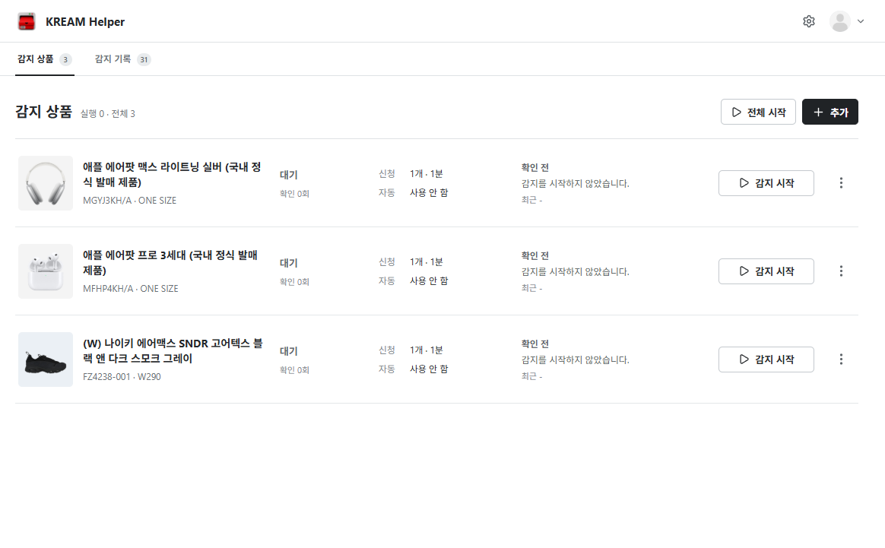

# KREAM Helper

KREAM 보관판매 신청 가능 상태 확인과 신청 절차를 돕는 Windows 프로그램의 공개 문서 저장소입니다.

- [프로그램 안내와 사용 설명서](https://jwpgdx.github.io/kream-helper/)
- [최신 Windows 설치 파일](https://github.com/jwpgdx/kream-helper/releases/latest)
- [변경 내역](https://jwpgdx.github.io/kream-helper/changelog)



> KREAM Helper는 크림 주식회사가 제작하거나 공식 승인한 프로그램이 아닙니다. 사용 전 사이트의
> 이용약관, 개인정보 처리방침과 자동 신청 안내를 확인하세요.

이 저장소에는 GitHub Pages용 문서만 포함되며 Electron 앱 소스는 포함하지 않습니다. 설치 파일과
SHA-256 체크섬은 GitHub Releases에서 배포합니다.

## 로컬 실행

```bash
npm install
npm run dev
```

## 정적 빌드

```bash
npm run build
npm run preview
```

기본 GitHub Pages 경로는 `https://jwpgdx.github.io/kream-helper/`입니다.
